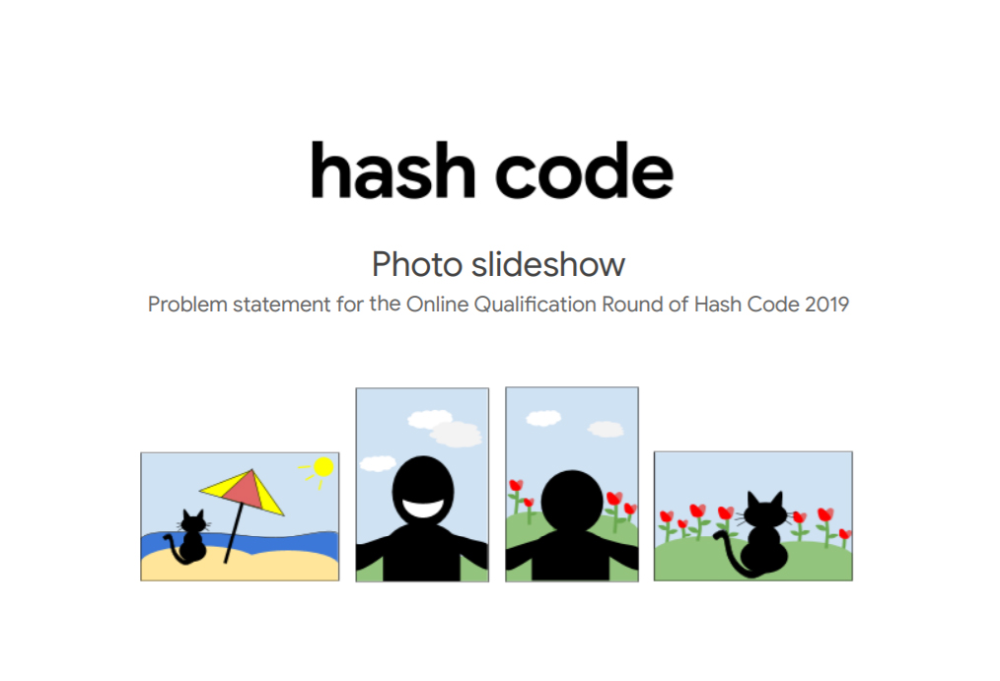

## Photo Slideshow

### Google Hashcode 2019 Online Qualification Round

This repository consists of our solution for the 2019 Google Hashcode online qualification round question.

The solution can be optimized further to reduce time taken to solve data sets b, d and e. There are some changes to be done to get a better score.

- A 2 points

- B 1551 points
